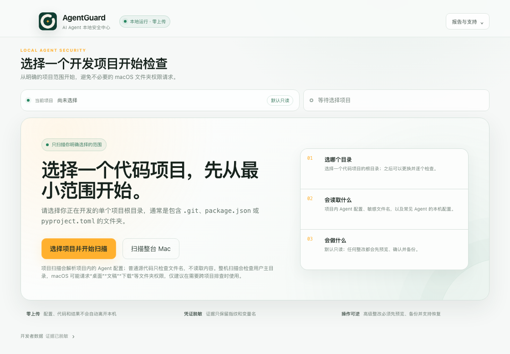

# AgentGuard

[简体中文（默认）](README.md) | [English](README.en.md)

> **Security Configuration Center for AI Coding Agents**
> 面向多 Agent、多模型、多 Provider 的 AI Coding Agent 安全配置中心

**让 AI Coding Agent 好用，也可控。**
**See, configure, and govern your AI coding agents safely.**

---

## ⚡ 30 秒看懂 AgentGuard

AgentGuard 是一个**本地运行、默认不修改 Agent 配置**的安全工具，提供 CLI 与 macOS Desktop，帮你看清并治理机器上多个
AI Coding Agent 的安全配置。它扫描 **Claude Code / OpenCode / Codex / CC Switch / Gemini CLI / OpenClaw**
的配置文件，识别未知中转 API、明文密钥、危险权限、可疑 MCP、以及被隐藏的代理链路，
并把风险汇成中文报告——**证据全程脱敏，绝不打印完整密钥**。

- 🔍 **看清** — `doctor` 发现 Agent 和配置路径，`scan/map` 展开模型、Provider 与代理链路
- ⚠️ **识险** — 深度解析每个 Agent 的 Provider / MCP / 密钥 / 权限风险（`scan`）
- 🗺️ **画图** — 生成多 Agent 配置地图，展开 Agent → 本地代理 → 真实上游两跳链路（`map`）
- 🔗 **关联** — 跨 Agent 集中点分析：多个 Agent 汇聚同一代理 / 未知端点即单点失陷面
- 📊 **行动报告** — 按“立即处理 / 需要确认 / 建议清理 / 配置观察”给出下一步和验证方法（`report`）

| 第一次使用前最重要的问题 | AgentGuard 的回答 |
|---|---|
| **连接谁？** | AgentGuard 自身不连接模型 Provider；它在本机还原各 Agent 已配置的 Provider、代理真实上游和 MCP 链路。 |
| **读取什么？** | 读取六类 Agent 的安全相关配置；项目目录只检查敏感文件名，不读取项目文件内容。凭证只在本机内存识别，输出不含完整值。 |
| **执行什么？** | `agentguard`、`doctor/scan/map/report` 默认只读；整改命令先作为文本展示。只有用户显式执行 Advanced 的 `apply/restore` 才修改受支持配置。 |

查看一份由真实 CLI 扫描合成配置生成的[脱敏输出示例](examples/scan-output.txt)。

---

## 🚀 快速开始

> 当前源码为 **Public Preview 候选版本（`0.0.5-pilot.3`）**，联合提供 npm CLI 和完成
> Developer ID 签名、Apple 公证的 macOS 桌面版。npm 包使用个人 scope，避免与现有 `agent-guard` 包混淆。

**环境要求**：Node.js ≥ 22（`scan`/`map` 读取 CC Switch 的 SQLite 配置依赖
`node:sqlite`；开发环境使用 Node 24+）。

### 从 npm 安装 CLI

```bash
npm install -g @wangmarsen/agentguard@next
agentguard --version
agentguard
```

**首发支持边界**：CLI 以 macOS 为主要端到端验证平台；Linux / Windows 当前标为 Beta，已有修复模板测试，
但六类 Agent 的真实配置路径尚未完成三平台全覆盖。macOS Desktop 首发目标为 **macOS 12+、Apple Silicon**；
Intel 构建尚未验证。本地 `.app` 是依赖当前源码与受信任 Electron 开发运行时的启动器；正式独立 DMG
必须通过 Developer ID 签名、公证和 staple 后才会发布。

### 从源码验证

```bash
git clone https://github.com/fengyufengzi/AgentGuard.git
cd AgentGuard
npm ci
npm test
npm link
agentguard --version
```

### Pilot 试用

受邀试用者请先阅读快速开始，并只提交脱敏后的反馈：

- 发给试用者：[`docs/pilot-quickstart.md`](docs/pilot-quickstart.md)
- 试用后填写并回收：[`docs/pilot-feedback-form.md`](docs/pilot-feedback-form.md)
- 当前产品能力摘要：[`docs/product-capabilities.md`](docs/product-capabilities.md)
- 安装、手动升级与卸载：[`docs/install-upgrade-uninstall.md`](docs/install-upgrade-uninstall.md)
- 结构化输出约定：[`docs/output-schema-v1.md`](docs/output-schema-v1.md)
- 63 条规则处置矩阵：[`docs/rule-disposition-matrix.md`](docs/rule-disposition-matrix.md)

试用记录不得包含完整配置、凭证或未脱敏内部信息。

### 安装、升级与卸载

Public Preview 使用 npm `next` 分发 CLI，并在同版本 GitHub Release 提供签名、公证的 macOS DMG；
源码贡献者仍可使用 `npm link`。第一公开版不做复杂自动更新，CLI 和桌面应用都采用手动升级。不同安装方式的完整命令、
升级步骤、本地状态保留策略和卸载说明见
[`docs/install-upgrade-uninstall.md`](docs/install-upgrade-uninstall.md)。

### Demo 流程

[观看 40 秒 macOS Desktop 合成演示](docs/assets/agentguard-desktop-demo.mp4)



演示使用完全合成的 Agent、项目、端点和任务，不读取真实配置。源码贡献者可运行
`npm run desktop:demo:build` 重新生成视频和封面。

```bash
# 首次使用：一次完成发现、扫描、实际链路和前三项行动
agentguard

# 需要展开原始扫描结果时继续使用兼容子命令
agentguard scan
agentguard map
agentguard report --format html
```

<details>
<summary>Advanced：预览、应用和恢复有限安全基线</summary>

```bash

# 先看受支持的 OpenCode / Claude Code / Gemini CLI / OpenClaw baseline 会改什么
agentguard baseline --profile balanced --dry-run

# 确认 diff 后再应用；apply 强制要求 --backup
agentguard apply --profile balanced --backup

# 如需回滚，恢复最近一次备份
agentguard restore
```

</details>

### Mac 桌面版（Public Preview）

当前 Electron 桌面预览直接复用 AgentGuard core 和稳定 taskId，不解析终端输出。首次启动会说明
本地运行、默认只读和不上传，首次打开以“选择项目并开始扫描”为主行动，整机检查是提示权限影响的次级入口。完成后进入按 Agent
切换的单页安全工作台，配置摘要、实际 Provider / 代理 / 上游链路、重点问题和修复步骤保持在同一处理路径；
完整技术证据按需展开，并可将 HTML 或 JSON 报告保存到用户选择的目录。同版本 GitHub Pre-release 提供
完成 Developer ID 签名、Apple 公证和 staple 的 Apple Silicon DMG。

这里的“项目”是你正在开发的单个代码项目根目录，通常包含 `.git`、`package.json`、`pyproject.toml`
等标识。项目扫描会解析项目内的 Agent 配置；普通源代码只检查文件名，不读取内容，同时仍会读取常见
Agent 的本机配置。整机扫描保留为次级入口，但会把用户主目录作为检查范围，macOS 可能因此请求访问
“桌面”“文稿”“下载”等受保护文件夹，建议只在需要跨项目排查时使用。

桌面版提供原生 macOS 应用菜单：`⌘R` 检查当前范围、`⇧⌘R` 只检查这台 Mac、`⌘O` 选择项目，
`⇧⌘E` 导出行动报告。菜单只向无权限 renderer 发送固定白名单动作，实际扫描和导出仍经过原有 typed IPC、
项目授权与原生文件选择器。窗口尺寸、位置和最大化状态会以 0600 权限保存在 Electron userData；不会保存项目路径、
端点或任务信息，损坏或离屏状态会自动回退。

结果页先显示全局 Top 3 行动，可直接进入对应 Agent 和任务；每个 Agent 默认展开前三项，其余任务按需查看。
键盘可使用左右方向键和 Home/End 切换 Agent。首次扫描、Top 3 跳转、返回列表和展开修复步骤均管理焦点；
VoiceOver 会朗读任务的优先级、严重程度、标题和原因。执行扫描或写入时，动态操作会暂时禁用并显示统一进度，
错误使用即时播报；界面与脚本滚动遵守 macOS“减少动态效果”设置。

行动卡支持接受当前风险、撤销接受和重新验证。风险接受只作用于当前项目并保留原因与到期时间。
未知/自建 Provider 另有“信任此端点”操作：端点由当前任务证据推导，原因写入项目配置并可撤销；
信任只消除未知来源提示，不会隐藏 HTTP、明文密钥或危险权限风险。
P2/P3 的非强制修复规则还可按“当前项目 + Agent + ruleId”忽略；该策略跨 evidence/taskId 变化持续
生效，但始终保留原因、到期、撤销审计和技术证据。P0/P1、明文密钥、执行权限、扫描盲区和 Provider
端点分类不会提供此入口。

“安全修改与恢复（高级）”区域会区分手动凭证迁移与自动配置收敛。Terminal 命令提供一键复制；自动整改
先展示逐文件 diff。只有预览指纹仍与当前配置一致，并在 macOS 原生确认框中再次
确认后，才会强制备份并应用受支持的有限变更；完成后立即复扫。当前桌面会话可一键恢复本次备份，
但若应用后文件又被其它工具修改，恢复会安全停止，避免覆盖新内容。

Claude Code 明文凭证任务在展示 Keychain / `apiKeyHelper` 迁移命令前提供“一键备份”。备份只包含实际含
明文字段的设置文件，并使用 0700/0600 权限和 Git 忽略保护；迁移后即使任务复扫消失，全局整改区仍保留
当前会话的“一键恢复”。恢复前会校验 manifest、备份内容和当前配置指纹，要求 macOS 原生确认，事务恢复
失败会自动回滚；恢复会重新带回旧明文字段，因此仍需轮换旧凭证。

CC Switch 代理接管写入 Claude Code、Codex 或 Gemini CLI live 配置的 `PROXY_MANAGED` 是公开的鉴权占位符，
不是真实 Provider Key，不会触发对应的明文凭证 P0；Claude 也不会因此生成迁移备份或 Keychain 建议。
只有 CC Switch 全局代理服务与该 Agent 的路由接管都开启时，报告才会标明“经 CC Switch”，并展开
“Agent → CC Switch 本地端口 → 真实 Provider”链路；真实 Provider 凭证仍在 CC Switch 侧单独检查。

遇到启动、扫描或整改问题时，可从顶部“报告”或系统“帮助”菜单选择“导出脱敏诊断”。应用仅在本机保存操作时间、固定操作名、
成功/失败状态和固定错误分类，不记录项目路径、Provider 端点、task ID、配置内容或原始错误文本，且不会
自动上传。只有用户主动导出时，才会把最近最多 200 条事件写到用户选择的 JSON 文件。

```bash
git clone https://github.com/fengyufengzi/AgentGuard.git
cd AgentGuard
npm ci
npm run desktop

# 使用完全合成数据离屏渲染欢迎页、总览、任务、链路和高级整改截图到系统临时目录
npm run desktop:preview:capture

# 使用合成场景生成约 40 秒 MP4 Demo 与封面
npm run desktop:demo:build
```

桌面版不要求用户预装全局 `agentguard`，扫描、任务聚合和报告均由应用内的编译产物完成。
如果 Electron 二进制下载较慢，开发安装时可临时使用
`ELECTRON_MIRROR=https://npmmirror.com/mirrors/electron/ npm run desktop`。

本地开发预览：

```bash
# 在系统临时目录生成可双击的开发预览 .app（依赖当前源码与 node_modules）
npm run desktop:pack

# macOS 26 不再生成无法启动的未公证 DMG；该命令会提示改走正式发布流程
npm run desktop:dist
```

对外发布使用独立的严格配置；缺少 Developer ID 或公证凭据时会直接失败，不会产出被误认为正式版的
未签名安装包：

```bash
# Apple Developer Program 审核通过并准备好凭据后执行
npm run desktop:release

# 验证代码签名、Gatekeeper、公证 ticket、DMG 完整性并输出 SHA-256
npm run desktop:release:verify
```

本地预览 App 使用系统 `osacompile` 生成，只负责调用当前仓库中已经受系统信任的 Electron 开发运行时，
不上传 Apple，也不能脱离源码目录分发。macOS 26 会终止缺少公证 ticket 的独立 Electron App，因此正式
独立包只使用 `electron-builder.release.yml`，启用 Hardened Runtime、entitlements、Developer ID 签名
和 notarization。
完整准备步骤见 [`docs/macos-release.md`](docs/macos-release.md)。

---

## 🧭 命令一览

下表以当前 `0.0.5-pilot.3` 候选源码为准。

主要扫描与变更命令支持 `--json`（`report` 用 `--format json`）；`risk` 当前输出人类可读审计信息。
机器输出带有
`schemaVersion: 1` 和 `command`，兼容约定见 [`docs/output-schema-v1.md`](docs/output-schema-v1.md)。

| 命令 | 作用 |
|---|---|
| `agentguard` | 统一首次入口：发现、扫描、实际链路、三类行动、Top 3 和下一条命令；`--json` 返回共享 first-run v1 契约 |
| `agentguard doctor` | 体检本机环境，列出已发现的 Agent 与配置路径（只探测存在性，不读密钥） |
| `agentguard scan` | 深度扫描全部 Agent 的风险；含**跨 Agent 关联**段；有高危及以上以退出码 `2` 退出 |
| `agentguard provider scan` | 仅输出 Provider / base_url / 代理链路相关风险 |
| `agentguard map` | 生成多 Agent 配置地图，展开代理两跳链路 |
| `agentguard report` | 扫描并生成可存档报告（`--format html\|json`，`--output <path>`，`-` 为标准输出） |
| `agentguard baseline --profile balanced --dry-run` | 生成 OpenCode / Claude Code / Gemini CLI / OpenClaw 安全基线建议和 diff，不写文件 |
| `agentguard backup` | 备份当前 OpenCode 配置到项目 `.agentguard/backups` |
| `agentguard credential backup <task-id>` | 按最新扫描任务备份 Claude Code 明文凭证迁移涉及的设置文件 |
| `agentguard credential restore <backup-id>` | 只读预览 Claude 迁移备份恢复；使用返回的 `--confirm <fingerprint>` 才写入 |
| `agentguard apply --profile balanced --backup` | 应用支持范围内的多 Agent baseline 变更，应用前强制备份 |
| `agentguard restore` | 恢复最近一次备份，或用 `--id <backup-id>` 指定 |
| `agentguard trust add <endpoint> --kind trusted\|internal --reason <原因>` | 登记当前项目的自建/内部 Provider 端点，保留追加式审计 |
| `agentguard trust list` | 查看当前项目的可信端点和审计事件数量（`--json` 返回完整审计） |
| `agentguard trust remove <endpoint> --kind trusted\|internal --reason <原因>` | 撤销端点信任，相关未知端点重新进入待办 |
| `agentguard ignore add <task-id> --rule <rule-id> --reason <原因>` | 从当前任务选择一条允许忽略的低优先级规则；可用 `--expires` 设置复审日期 |
| `agentguard ignore list [--all]` | 查看当前项目有效/已过期规则忽略和追加式审计 |
| `agentguard ignore remove <rule-id> --agent <agent> --reason <原因>` | 撤销项目规则忽略，使相关发现重新进入待办 |
| `agentguard risk accept <task-id> --reason <原因> [--confirm]` | 先展示整组规则条件；只有显式确认才从默认待办和高危退出码移除并保留审计 |
| `agentguard risk list [--all]` | 查看有效接受记录，或包含已过期/已撤销的完整历史 |
| `agentguard risk verify <task-id>` | 重新扫描并判断任务已解决、缓解、仍存在、接受或身份变化 |
| `agentguard risk revoke <task-id>` | 撤销风险接受，使任务重新进入默认待办 |

### `doctor` — 环境体检

```text
$ agentguard doctor

AgentGuard Doctor

Detected agents:
  [OK] Claude Code  found  ~/.claude
  [OK] Codex        found  ~/.codex/config.toml
  [OK] CC Switch    found  ~/.cc-switch/cc-switch.db
  [OK] OpenCode     found  ~/.config/opencode/opencode.json

Summary: 6/6 agents configured.
```

### `scan` — 深度风险扫描

按 Agent 分段列出风险，末尾追加**跨 Agent 关联**与 Summary。对 Codex / CC Switch 等不可自动收敛的
高危项，会在风险条目下附**分步手动整改步骤**。示例（端点已改为示意值）：

```text
$ agentguard scan

▍Claude Code  1 项
  [提示] Claude Code 使用本地代理接管配置  (CLAUDE_LOCAL_BASE_URL)
        证据: baseUrl=http://127.0.0.1:15721

▍CC Switch  1 项
  [高危] Provider 配置中存有明文密钥  (CCSWITCH_PLAINTEXT_KEY)

▍跨 Agent 关联
  [高危] 2 个 Agent 共用同一本地代理 127.0.0.1:15721  (XAGENT_SHARED_PROXY)
        证据: proxy=127.0.0.1:15721 | agents=Claude Code, CC Switch | count=2

────────────────────────────────────────────────
Summary: 共 N 项风险  严重 0 · 高 x · 中 y · 低 0 · 提示 z  （含跨 Agent 关联 1）
```

用于 CI：

```bash
agentguard scan --json > scan.json   # 有高危及以上时退出码为 2
```

### `map` — 多 Agent 配置地图

```text
$ agentguard map

AgentGuard 配置地图

  Agent        配置  端点              MCP  密钥  敏感  权限  风险
  ───────────  ────  ────────────────  ───  ────  ────  ────  ────
  Claude Code  ✓     127.0.0.1:15721   0    1     0     0     高危
  Codex        ✓     127.0.0.1:7890    2    0     0     1     中危
  CC Switch    ✓     relay.example +4  0    2     0     0     高危
  OpenCode     ✓     —                 0    0     0     0     OK
  当前项目     ✓     —                 0    0     1     0     高危

代理链路（真实上游）：
  claude  →  本地代理 127.0.0.1:15721  →  https://relay.example
  提示：base_url 指向本地代理时，勿把 127.0.0.1 误判为安全本地服务。
```

### `report` — 可存档报告

```bash
agentguard report                        # → ./agentguard-report.html
agentguard report --format json          # → ./agentguard-report.json
agentguard report -f html -o -           # 输出到标准输出
```

HTML 为自包含单文件（内联 CSS + 内联 JS，无外部依赖，可离线打开），所有动态内容
HTML 转义。报告首页先按行动优先级展示 **立即处理 / 需要确认 / 建议清理 / 配置观察**，每项包含
下一步、验证方法和处置方式；baseline 与部分凭证场景还会按当前 macOS / Linux / Windows 生成
本机命令模板，其余任务继续提供人工步骤。聚合任务逐条展示全部关联规则的下一步、验证和接受条件，
并标明命令属于“完整解决 / 风险缓解 / 辅助步骤”。命令可以复制，但静态 HTML 不会直接执行本地操作；
修改配置后需运行卡片中的 `risk verify` 并重新生成报告。下方继续保留 **Agent × 严重度总览表**与严重度过滤。

### `risk` — 接受、查看与撤销风险

> `0.0.5-pilot.1` 已完成 acceptance 项目作用域、聚合条件、接受前确认、单任务验证和 Release 资产回装验证。
> 当前只用于受邀私有 Pilot；不要把本机 acceptance 文件当作团队共享策略。

如果某个任务是经过确认的预期配置，例如个人自建且已检查 TLS、访问控制和数据范围的示例中转，
可以从报告卡片复制稳定 `task-id` 并执行：

```bash
agentguard risk accept task-xxxxxxxxxxxx --reason "个人自建示例中转，已核对 TLS 与访问控制" --confirm
agentguard report --format html
```

接受后，该任务不会再进入默认行动队列，也不会触发 `scan/report` 的高危退出码；HTML 仍会在
“已接受风险”和技术证据区保留记录。可选 `--expires 2026-12-31` 设置到期时间，到期后任务会自动恢复：

```bash
agentguard risk list
agentguard risk list --all
agentguard risk verify task-xxxxxxxxxxxx
agentguard risk revoke task-xxxxxxxxxxxx
```

不带 `--confirm` 的 `risk accept` 只做接受前检查：列出整组任务的全部规则、严重度和接受条件，不写入记录。
`risk verify` 会重新扫描，并区分已解决、仍存在、部分缓解、已接受、接受已过期/撤销和任务身份变化；
缺少报告快照或接受历史时会明确返回“无法确认”，不会猜测为已解决。
报告生成时会在 `~/.agentguard/task-snapshots.json` 保存不含 evidence、路径、动态标题或端点的规则摘要，
用于比较处置前后的任务状态。

审计历史默认保存在 `~/.agentguard/acceptances.json`，目录权限为 `0700`、文件权限为 `0600`。
记录按规范化当前项目的不可逆 `scopeId` 隔离，不保存项目路径；旧版无作用域记录仅保留为不生效的
legacy 审计。撤销和过期只改变状态，不会删除历史。P0 任务不允许永久接受，必须显式提供 `--expires`。

### 接入 CI / 团队门禁

`scan` 在发现**高危及以上**风险时以退出码 `2` 结束，可直接当 PR 门禁：

| 退出码 | 含义 |
| --- | --- |
| `0` | 未发现高危及以上（无风险 / 仅中低危 / 仅提示） |
| `2` | 存在 `high` / `critical`（含跨 Agent 关联项） |

最小 GitHub Actions 片段：

```yaml
- run: npm install -g @wangmarsen/agentguard@next
- run: agentguard scan            # 高危 → 退出码 2 → 挡 PR
- run: agentguard report -f html -o agentguard-report.html
  if: always()                    # 存档一份脱敏报告
```

完整可复用示例见 [`examples/ci/agentguard-gate.yml`](examples/ci/agentguard-gate.yml)
（含 artifact 存档）。报告与退出流程同样脱敏，不打印明文密钥。

### `baseline` — 安全基线 dry-run

覆盖 **OpenCode / Claude Code / Gemini CLI / OpenClaw** 的有限可逆配置建议，且必须显式传入
`--dry-run`；命令只生成建议和 diff，不会写入任何配置文件。

```bash
agentguard baseline --profile balanced --dry-run
agentguard baseline --profile safe --dry-run --json
```

- **OpenCode**：`balanced` 将高风险 Bash 放行改为 `ask`、`share=auto` 改为 `manual`、关闭显式
  `autoupdate=true`；`safe` 在此基础上把显式放行的 `edit` / `webfetch` 也改为 `ask`、`share=auto`
  改为 `disabled`。
- **Claude Code**：`bypassPermissions` 收敛回 `default`、移除 `permissions.allow` 中无约束的
  Bash / 通配规则、`enableAllProjectMcpServers` 改为 `false`。
- **Gemini CLI**：MCP per-server `trust=true` 改为 `false`。
- **OpenClaw**：网关暴露面收敛 —— `gateway.bind` 非 loopback 改回 `127.0.0.1`、
  `gateway.tailscale.mode` 的 funnel / public / expose 改为 `off`。

明文密钥类风险不会进入普通 baseline 自动修改。报告只会为部分凭证场景按操作系统生成 Keychain、
Secret Service、DPAPI 或当前进程注入的引导模板，不会自动修改 Agent 凭证引用、验证真实认证、清理或
轮换旧密钥，也不会把密钥写入 shell profile、普通 `.env` 或 Windows 用户环境后伪称已完成迁移。
环境变量只是传递通道，不等于安全存储；完成安全存储、配置引用和旧凭证轮换后仍需复扫。
**Codex**（TOML，改写会丢注释/格式）与 **CC Switch**（只读 SQLite，坚持「默认只读」底线）暂**只在
scan/report 中提示，不纳入自动收敛**；但其不可自动收敛的高危项会在 `scan` 终端、HTML / JSON 报告中
附上**分步手动整改指引**（`remediation`），照着步骤即可自行修复。

### `backup` / `apply` / `restore`

`apply` 覆盖上述四个 Agent 的 baseline 变更，必须显式传入 `--backup`，执行前会把原配置复制到
当前项目 `.agentguard/backups/<backup-id>/`。备份目录仅当前用户可读，manifest 记录哈希与原文件
权限，并自动创建 Git 忽略保护，降低完整原配置被 `git add .` 误提交的风险；写入使用同目录临时文件
原子替换，失败时自动恢复备份。

```bash
agentguard backup
agentguard apply --profile balanced --backup
agentguard restore
agentguard restore --id <backup-id>
```

备份 manifest 记录原始路径和备份文件路径；`restore` 会把备份文件复制回原始路径。

Claude Code 明文凭证迁移使用更窄的专用命令。备份前会重新扫描并确认 `<task-id>` 仍对应
`CLAUDE_PLAINTEXT_TOKEN`，只复制实际含明文字段的 `settings.json` / `settings.local.json`：

```bash
agentguard credential backup <task-id>
agentguard credential restore <backup-id>
agentguard credential restore <backup-id> --confirm <fingerprint>
```

第一条 `restore` 只预览，不写文件，并返回当前配置指纹；第二条只有在备份完整、目标仍属于当前 Claude
配置目录且文件在预览后没有变化时才事务恢复。恢复会重新带回旧明文字段，只用于迁移后启动或鉴权异常的
故障回退，不能替代旧凭证轮换和再次迁移。Desktop 继续使用同一 core 的“一键备份 / 一键恢复”，并额外
保留当前应用会话授权和 macOS 原生确认。

---

## 🛡️ 隐私与安全承诺

- **扫描默认不改 Agent 配置** — `doctor/scan/map/report` 不修改 Agent 配置；`report` 只写不含 evidence、路径或端点的
  本机任务规则快照。只有显式执行 `apply/restore` 或带预览指纹确认的 `credential restore` 才会写入受支持
  配置，`risk accept/revoke` 只写本机审计状态。
- **本地运行** — 所有扫描在本机完成，不上传任何服务器。
- **诊断由用户控制** — 桌面诊断日志位于应用的本机 userData 目录，目录权限 0700、文件权限 0600；
  只记录固定事件字段，不含项目路径、端点、task ID、配置内容或原始错误文本。诊断文件仅在用户主动
  选择位置后导出，不会自动上传。
- **脱敏输出** — 报告绝不含完整 API Key / Token / 私钥：`doctor` 仅探测密钥文件是否存在；
  密钥比对用 **SHA-256 指纹前缀**关联，MCP 环境变量只暴露**键名**；`base_url` 作为端点标识展示。
- **可解释** — 每条风险都带判断依据与建议，未知端点只提示、不武断拦截。

> 每次功能变更均跑跨 Agent 泄漏回归：从真实配置抓密钥，grep `scan --json` 输出，确保 0 命中。

---

## 🧩 已支持的 Agent

| Agent | 支持深度 | 说明 |
|---|---|---|
| CC Switch | 🟢 深度 | Provider 列表 / base_url / 明文密钥 / 共享密钥指纹 / 内置反向代理两跳链路 |
| Codex | 🟢 深度 | 自定义 Provider / MCP（remote/stdio）/ 明文密钥 / trusted 项目 / 代理 |
| Claude Code | 🟢 深度 | base_url / 明文 token / bypassPermissions / 危险 allow / hooks / MCP |
| OpenCode | 🟢 深度 | 自定义 Provider / 明文密钥 / bash 权限 / share / autoupdate / MCP |
| Gemini CLI | 🟢 定向深扫 | MCP trust / remote/stdio MCP / MCP env 密钥键 / `.env` 明文密钥 / shell 无 sandbox；凭证值不进入输出 |
| OpenClaw | 🟢 定向深扫 | `appSecret` / `auth.token` / 非 loopback `bind` / Tailscale `funnel` / workspace 冲突 / 未知插件源；支持有限网络暴露面收敛 |
| 当前项目 | 🟡 基础风险 | 只按文件名扫描 `.env`、私钥、云凭证、kubeconfig 等敏感文件 |

### Provider 分类

官方（OpenAI / Anthropic / Google / Azure）、国内官方（DeepSeek / Kimi / GLM / 通义千问 /
火山方舟 / 百度千帆 / 腾讯混元 / MiniMax）、本地 / 内网、公网裸 IP 与未知中转端点均有
独立判定与风险等级。

### Provider 白名单

推荐使用命令把自建/企业端点登记到项目根目录的 `.agentguard.json` 或已有
`agentguard.config.json`，无需手写 JSON：

```bash
agentguard trust add https://ai.example.com/v1 --kind trusted --reason "个人维护，已核对 TLS 与访问控制"
agentguard trust list
agentguard trust remove ai.example.com --kind trusted --reason "服务已停止使用"
```

配置只影响“未知/中转端点”判定，不会隐藏明文 `http`、密钥或权限风险。变更原因会进入项目配置的
追加式审计记录，可能随项目提交，请勿填写凭证或其它秘密。

```json
{
  "providers": {
    "trusted": ["https://ai.example.com", "*.corp.example.com"],
    "internal": ["llm.internal.local"]
  }
}
```

`trusted` / `internal` 均支持完整 URL、host、`*.example.com` 通配域名。

### 项目级规则忽略

当一条 P2/P3 规则已在当前项目审核、但不希望 evidence 或 task ID 变化后反复提示时，使用报告生成的命令：

```bash
agentguard ignore add task-xxxxxxxxxxxx --rule OPENCODE_MCP_LOCAL --reason "已审核固定版本的项目内文档 MCP"
agentguard ignore list
agentguard scan
agentguard ignore remove OPENCODE_MCP_LOCAL --agent opencode --reason "项目已移除该 MCP"
```

`ignore add` 不接受任意规则：它会重新扫描并验证 taskId、Agent、ruleId 和处置矩阵。策略写入项目配置，
只保存规则、Agent、原因和时间，不保存 evidence、端点、路径或 taskId。原因可能进入版本控制，请勿填写
秘密。若只是暂时接受一个具体任务，使用 `risk accept`；若确认自建 Provider 归属，使用 `trust add`。

---

## 🏗️ 架构

```
src/
├── cli.ts                 # CLI 入口（commander）
├── adapters/              # 每个 Agent 一个适配器：discover() + 可选 deepScan()
│   ├── claude-code/       #   parse.ts（读+归一化，不返回明文） + risk.ts（产出 findings）
│   ├── codex/
│   ├── cc-switch/
│   ├── opencode/
│   ├── gemini/
│   ├── openclaw/
│   └── index.ts           #   adapter 注册表
├── rules/
│   └── provider.ts        # classifyBaseUrl：Provider 端点分类（各 adapter 共用）
└── core/
    ├── discovery/         # Agent 发现
    ├── scan/              # 扫描编排（discover → deepScan → 汇总）
    ├── correlate/         # 跨 Agent 集中点分析
    ├── action/            # 规则处置、任务身份与根因聚合
    ├── remediation/       # macOS / Linux / Windows 修复命令模板
    ├── acceptance/        # 风险接受、到期、撤销与本地审计
    ├── triage/            # 将项目规则忽略和有效接受应用到默认结果与退出码
    ├── config/            # Provider 信任与项目级规则忽略策略、追加式审计
    ├── baseline/          # 有限安全基线计划
    ├── apply/             # 备份、原子写入、恢复和并发修改检查
    ├── map/               # 配置地图派生
    ├── report/            # doctor / scan / map 终端格式化 + HTML 报告
    ├── output-contract.ts # JSON 输出 schemaVersion / command 契约
    └── fs-safety.ts       # 原子写入与文件权限保持
```

设计原则：**adapter 架构**。新增 Agent 支持只需新增一个 adapter 并在 `adapters/index.ts`
注册，无需改动核心引擎。

---

## 🧪 开发

首次贡献请先阅读 [`AGENTS.md`](AGENTS.md)、[`CONTRIBUTING.md`](CONTRIBUTING.md) 和
[`REVIEW.md`](REVIEW.md)。仓库内 `.agents/skills/` 提供新增 Agent、修改安全规则和桌面 IPC 的可执行工作流。

```bash
npm run build     # tsc → dist/
npm run dev       # tsc --watch
npm run check     # 提交前完整门禁：隐私、测试、贡献契约、dist 和发布内容
npm run check:repo # 检查贡献文档、技能、Desktop IPC 和诊断白名单一致性
npm run evals:check # 校验 AI 冷启动评测定义，不调用模型
npm run evals:preflight # 冷启动评测前检查工具链与干净基线，不调用模型
npm run sanitize  # 检查当前受 Git 跟踪文件中的敏感信息
npm run sanitize:staged   # 提交前只检查暂存文件
npm run sanitize:package  # 按 npm pack 实际文件清单检查发布内容
npm run package:verify-install # 真实 tarball → 临时 prefix 安装 → 本地 npx 版本验证
npm run release:scan-assets -- --tarball /path/to/package.tgz --dmg /path/to/AgentGuard.dmg
npm run sanitize:history  # 开源前检查所有可达 Git 历史
npm test          # 构建后跑 node:test 全套（test/**/*.test.mjs）
npm run clean     # 删除 dist/
```

**测试约定**：从 `dist/` 导入编译产物（与 NodeNext 的 `.js` 说明符一致），用
`node:test` / `node:assert`；夹具在临时目录构造配置文件、用后清理；每个 adapter
测试均含**隐私红线回归**（断言完整 findings 序列化中不含明文密钥）。

跨模块长期决策记录在 [`docs/adr/`](docs/adr/README.md)；无额外提示的 AI 贡献评测协议位于
[`evals/`](evals/README.md)。

仓库公开前仍需完成 Git 历史、发布资产、CI 和仓库权限检查。安全问题请通过
[`SECURITY.md`](SECURITY.md) 中的私密渠道报告，不要在公开 Issue 中粘贴真实配置或凭证。

---

## 📄 License

MIT — 见 [`LICENSE`](LICENSE)。

---

<p align="center">
  <sub>Built with ❤️ — 让 AI Coding Agent 好用，也可控。</sub>
</p>
